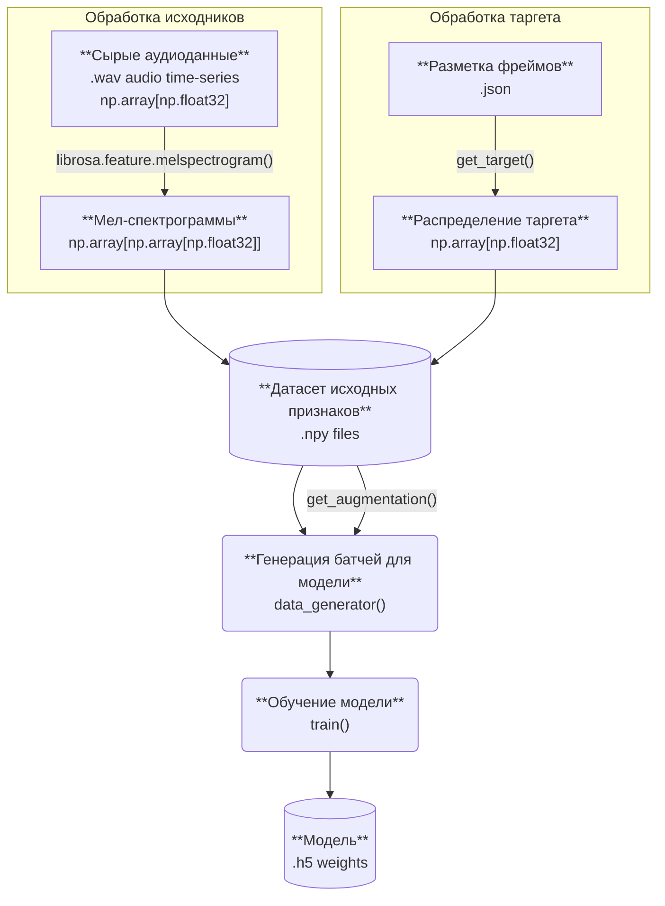
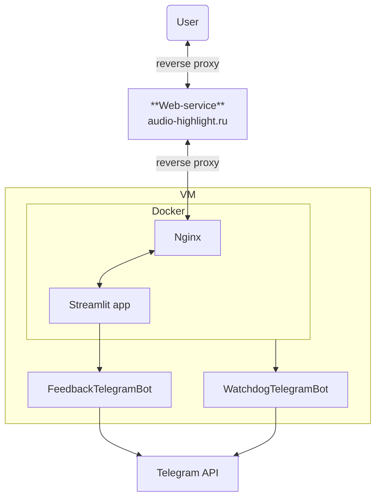

# :headphones:[Audio-Highlight](https://audio-highlight.ru/):headphones:
## Introduction
Задачей было создание технологии, предсказывающей наиболее "интересный" для среднего слушателя фрагмент музыкальной композиции, и сервиса на её основе. Способность выделять в музыкальных композициях наиболее интересные моменты может быть полезным инструментом повышения Average Session Length Time и Retention Rate различным стриминговым платформам.
Яркими примерами подобных инструментов могут служить "сниппеты" в VK Музыке и "трейлеры" Я.Музыки. Данные стриминги используют различные алгоритмы выбора фрагмента, который будет предложен слушателю и их наличие говорит о возможном положительном эффекте для платформы.
## Prior Research
При работе над проектом мы понимали "интересность" музыкального фрагмента как относительное свойство удерживать слушателя от переключения\выключения. Предпосылкой послужило умозаключение о том, что слушатели запоминают и переслушивают определенные части композиций чаще других. То есть, необходимо по некоему алгоритму анализировать композицию и размечать её на части. Иначе говоря, речь идет о задаче сегментации.

Сегментация и анализ структуры музыкальных треков широко описаны в различных работах, приведём здесь показавшиеся наиболее релевантными:
1. DEEPCHORUS: A Hybrid Model of Multi-scale Convolution and Self-attention for Chorus Detection [arxiv](https://arxiv.org/abs/2202.06338)
2. Audio Defect Detection in Music with Deep Networks [arxiv](https://arxiv.org/abs/2202.05718)
3. Tim Groot. Automated hook detection for popular music using deep learning. Bachelor Thesis. University of Amsterdam.
4. Automatic Music Highlight Extraction using Convolutional Recurrent Attention Networks [arxiv](https://arxiv.org/abs/1712.05901)
5. Automatic Structural Segmentation of Music: Insightfully clustering the beats in a given piece of music to reflect it's musical structure [link](https://www.overleaf.com/articles/automatic-structural-segmentation-of-music-insightfully-clustering-the-beats-in-a-given-piece-of-music-to-reflect-its-musical-structure/gbrpdjgrrbnk)
6. On Music Structure Analysis: Machine learning implementations of the Segmentation by Annotation approach [link](https://studenttheses.uu.nl/handle/20.500.12932/36522)
7. To catch a chorus, verse, intro, or anything else: Analyzing a song with structural functions [arxiv](https://arxiv.org/abs/2205.14700)
8. Can we predict the Most Replayed data of video streaming platforms? [arxiv](https://arxiv.org/abs/2309.06102)

Итоги первичного анализа кейса представлены [тут](Prior%20Research.pdf).
#### Research results
После исследований и экспериментов, в качестве основы для модели была выбрана архитектура Deepchorus (п.1 в списке выше), краткий обзор которой ниже, а подробное описание доступно в статье по ссылке.
## Data
### Train Dataset

##### Charts
Для обучения модели был собран, подготовлен и размечен датасет музыкальных композиций из чартов российского сегмента аудио-стримингов. 
Список композиций для сбора и разметки был составлен из объединения следующих источников:

| Чарт                                                                                | Период времени             | Сервисы                                                               | Количество треков |
| ----------------------------------------------------------------------------------- | -------------------------- | --------------------------------------------------------------------- | ----------------- |
| [Mooscle Charts](https://mooscle.com/charts/)                                       | С 21.07.2018 по 15.02.2024 | Apple Music, iTunes, YouTube, Deezer, Boom VK, Boom OK, Яндекс.Музыка | 2098              |
| [Kworb Spotify Top 200 RU](https://kworb.net/spotify/country/ru_weekly_totals.html) | C 16.07.2020 по 31.03.2022 | Spotify Top 200 RU                                                    | 1926              |
| [Kworb iTunes Top 100 RU](https://kworb.net/popru/cumulative.html)                  | C 13.08.2013 по 15.02.2024 | iTunes Top 100 Ru                                                     | 2000              |
После объединения чартов и удаления дублей итоговый датасет составил **5513** треков.
##### Target
Была разработана методика оценки "интересности" частей музыкальных композиций, основанная на анализе частоты использования различных фрагментов треков, что позволило получить нормализованные числовые значения, отражающие степень популярности или привлекательности каждого фрагмента в диапазоне [0, 1].
В итоге, после получения разметки датасет составил **1551** треков.
### Test Dataset
Для финального замера обученной модели был подготовлен датасет из **100** треков, не входивших в обучающий датасет и размеченных вручную. Треки, вошедшие в данный датасет были взяты из чартов Top 50 Global в Spotify и топ-100 в Яндекс.Музыке.
Для данного датасета применялась экспертная оценка командой проекта для симуляции оценки интересности среднестатистическим слушателем.
## Архитектура модели
#### Model Overview
Модель из оригинальной статьи разрабатывалась для решения задачи сегментации аудиокомпозиции с поиском припева внутри неё. 

Структурно модель представляет собой две последовательных секции:
-  Multi-Scale Network - вариация Feature Pyramid Network, входные признаки сначала понижаются до низкого разрешения, чтобы облегчить извлечение глобальной информации, а затем объединяются до высокого разрешения. Таким образом выделяется семантика на разных структурных уровнях композиции - от взаимоотношений рядом стоящих нот до разных частей композиции.

- Self-Attention Convolution Network - представляет собой цепочку Self-Attention и сверточных блоков, принимающих на вход признаки, выделенные Multi-Scale Network. В конце концов, несколько последовательных сверточных слоев и softmax преобразуют последовательность в вектор вероятностей размерностью [sample rate] - каждое число соответствует вероятности фрейма исходной аудиокомпозиции быть припевом.\

#### Обучение
Авторы архитектуры обучали модель на бинаризированной разметке в виде вектора из 0 и 1, несущего смысл:
```
0 - фрейм не является припевом,
1 - фрейм является припевом
```
Для подсчета потерь и метрик, авторы переводят выходящий вектор вероятностей к такому же бинарному формату что и входная разметка с помощью адаптивного threshold'а.
В нашем случае же от модели требуется научиться только приближать форму распределения "интересности" музыкальной композиции. Поэтому от этого механизма в нашей реализации было решено отказаться и обучение происходило на полученной авторским методом разметке.
#### Augmentation
Для увеличения количества данных, в пайплайне обучения была предусмотрена аугментация признаков:
1. Аффинное преобразование признаков вдоль временной оси
2. Аффинное преобразование признаков вдоль частотной оси
3. Изменение тона (pitch shift) - равномерное изменение частот. Для каждой аугментации случайно выбиралось направление и количество полутонов в диапазоне [-11, 11]
4. Замедление\ускорение трека (time stretch) в диапазоне [0.75, 1.25]
5. Time masking - применение масок для небольших частей аудио (от 1 до 5 секунд) усреднённой величиной
6. Mels masking - маскирование мел-коэффициентов (от 1 до 5 подряд идущих) так же средним значением
####  Граф преобразования данных


#### Метрика
Модель при инференсе выдает вектор "интересности" трека, по которому окончательно предсказывается место highlight'а:\
\
$$prediction = [p_1,p_2,..p_i, ..,p_n],\ i=\overline{1,n},\ n = sample\ rate\ \cdot \ duration$$\
\
Затем находятся площади под кривой "интересности" шириной равной длительности хайлайта (30 секунд):\
\
$$AUC_{j} = \int_{j}^{i+highlight\ duration} prediction(t) \,dt\$$\
\
$$areas = [AUC_1,AUC_2, ..AUC_j, ..,AUC_m],\ j=\overline{1,m},\ m = n - highlight\ duration$$\
\
Окончательное предсказание хайлайта происходит на следующем шаге:\
\
$$highlight = arg\ max_{m}(areas)$$\
\
Для имеющегося "золотого" датасета, на котором происходили финальные замеры моделей, полученные предсказания сравнивались с ручной разметкой. Для количественной оценки применялась метрика Intersection Over Union:\
\
$$IoU=\frac1{n}\sum_i^{n}\frac{highlight_i\cap ground\ truth_i}{highlight_i\cup ground\ truth_i}$$
## Web-сервис
На основе обученной модели был создан веб-сервис:

#### Model Weights
Обучение модели производилось с помощью фреймворка Tensorflow. Однако, в процессе разработки приложения, в целях ускорения инференса веса обученной модели были конвертированы в формат .onnx.
### Функционал приложения
Веб-приложение полностью реализовано на основе фреймворка Streamlit. 
Пользователю доступна загрузка аудиофайлов (поддерживаются форматы .mp3 и .wav), после чего предлагается выбрать те, с которыми будут проводится дальнейшие действия.

Для отмеченных треков возможно как индивидуальное выделение хайлайтов, так и формирование плейлиста - приложение сформирует плейлист отсортировав треки по BPM с плавными переходами между хайлайтами:


#### Feedback & Alerting Bots
В приложении реализовано два телеграм-бота:
1. FeedbackBot: пользователи могут использовать форму обратной связи для отправки отзыва о своих впечатлениях от сервиса. Сообщение будет доставлено команде с помощью телеграм-бота.

2. WatchdogBot: состояние докер-контейнеров мониторит скрипт, посылающий сигнал команде об изменениях в статусах с помощью телеграм-бота.
